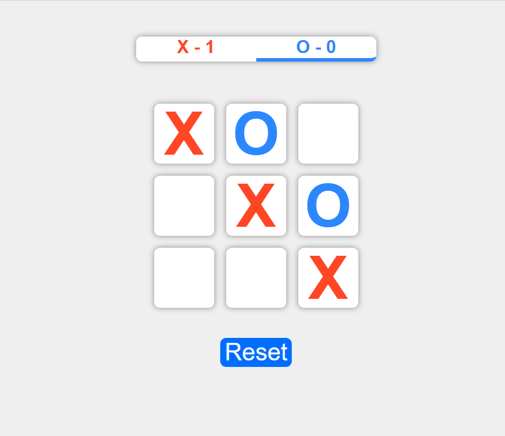

# Tic-tac-toe

#### By: Viktoria Zubarieva

#### Description

Simple React tic-tac-toe game application. This game can be played by two users. Each one can have their turn. The winner is user who can have 3 X's or O's in a row or diagonaly.

## Technologies Used

- React
- JavaScript
- CSS
- HTML

## Setup/Installation Requirements

- _Clone repository from GitHub_
- _Open your terminal and run the command $ git clone https://github.com/vzubarieva/Tic-tac-toe/tree/main/tic-tac-toe_
- Navigate to "tic-tac-toe"
- Open in code editor (VS Code)
- Install dependencies: $ npm install
- Run Program $ npm run start ( It should open the server http://localhost:3000/ )

## Known Bugs

## License

_MIT_

Copyright (c) _2023_ _Viktoriia Zubarieva_
